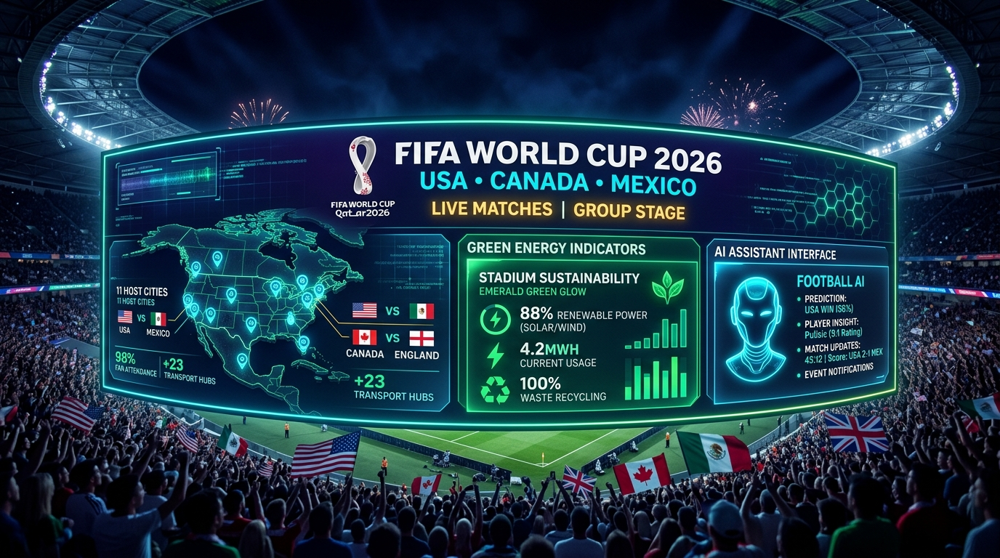

# ArenaPulse AI ⚽ 
### FIFA World Cup 2026 Stadium Operations & Fan Assistant



ArenaPulse AI is a premium, GenAI-enabled stadium operations and fan experience platform designed to revolutionize matchdays during the FIFA World Cup 2026. Built as a sleek, highly responsive Single Page Application (SPA), it provides real-time value to fans, volunteers, venue staff, and stadium organizers.

---

## 🌟 Key Features

### 1. Fan Assistant & Multilingual Hub (Chatbot)
*   **GenAI Multilingual Chatbot:** Instant translations and stadium support across 6 major languages: **English, Spanish, French, Portuguese, Arabic, and Japanese**.
*   **Gemini 2.5 Integration:** Easily configure a Gemini API key locally to run live LLM requests or fallback to our high-fidelity, client-side keyword simulation engine.
*   **Quick Action Chips:** Tap suggestions to get quick information on stadium policies (bags, transit, accessibility, food, schedule).

### 2. Smart Wayfinding & Seat Locator
*   **Interactive SVG Stadium Map:** Real-time stadium seating stands outline with pulse gate markers.
*   **Seat Path Routing:** Input seats (e.g. `Sec 102, Row B, Seat 4`) to highlight the stand section and draw a direct route line from the closest entry gate.
*   **Accessible Routing Toggle:** Reroutes directions away from staircases to utilize elevators, ramps, and sensory-friendly avenues automatically.

### 3. Operations & Crowd Control Dashboard (Staff/Volunteers)
*   **Live Crowd Density Heatmap:** Displays an interactive grid of sections with color-coded density indicators (Low, Moderate, High, Critical) and key stadium flow statistics.
*   **GenAI Dispatch Triage:** Operations staff can file venue incidents (Medical, Security, Spill, Crowd, Transit). The system automatically evaluates priority, schedules resources, estimates arrival times, and generates action protocols.
*   **Bilingual PA Announcement Drafter:** Automatically drafts stadium announcements in English & Spanish based on active incidents or presets (e.g., Heavy Rain Delay, Gate C Closed, Transit Delays).
*   **Audio Read-Aloud (Accessibility):** Uses browser Speech Synthesis to read PA drafts out loud for audio-impaired operators and stadium announcements.

### 4. Transit & Smart Sustainability Hub
*   **Transit Congestion Planner:** Dynamic lists of transit lines (Metro, Shuttles, Rideshares) with status badges and traffic recommendations.
*   **EcoScore Fan Rewards:** Logs fan sustainability tasks (subway transit, recycling bottles, bringing reusable containers) to calculate rewards, unlock level badges (Eco Fan, Green Champion, Arena Guardian), and generate custom AI green tips.

---

## 🛠️ Architecture & Technology Stack

*   **HTML5 & Vanilla JS:** Clean, semantic structure with fast rendering and no compile/build overhead.
*   **Vanilla CSS3:** Highly premium styling system using CSS variables, ambient gradient background glows, glassmorphism, responsive grid flex layouts, and custom animations.
*   **Lucide Icons:** Scalable vector icons for sharp UI presentation.
*   **Google Gemini API Client:** Direct, secure client-side integration utilizing standard REST API calls to `gemini-2.5-flash`.
*   **Web Speech Synthesis API:** Built-in accessibility tool for speaking announcements and directions.

---

## 🚀 How to Run the App

Since ArenaPulse AI is a static web app, it has **zero dependencies** and does not require node installs. 

1.  Clone this repository:
    ```bash
    git clone https://github.com/yaswanthsribalachandra/Promptwars_Challenge_4.git
    ```
2.  Open `index.html` directly in any web browser (Chrome, Safari, Firefox, Edge).
3.  *(Optional)* Click the gear icon (`⚙️`) in the top right to configure your own **Gemini API Key**. The key is saved locally in your browser cache and is only sent directly to Google's API endpoint.

---

## 📋 Assumptions Made

1.  **Direct API Access:** It is assumed that the client machine has internet access to query the Google Gemini endpoint and load SVG icons via the CDN.
2.  **API Key Fallback:** If no API key is provided, the application simulates high-fidelity responses locally using context-aware translation dictionaries to ensure the app is fully functional out-of-the-box.
3.  **Local Storage:** The application uses browser `localStorage` to persist accessibility settings, API keys, and sustainability points across refreshes.
4.  **Stadium Geography:** A generic 4-gate circular stadium structure is modeled with 6 main stands (North, West, East, South, VIP, Mid) for routing simulation purposes.
